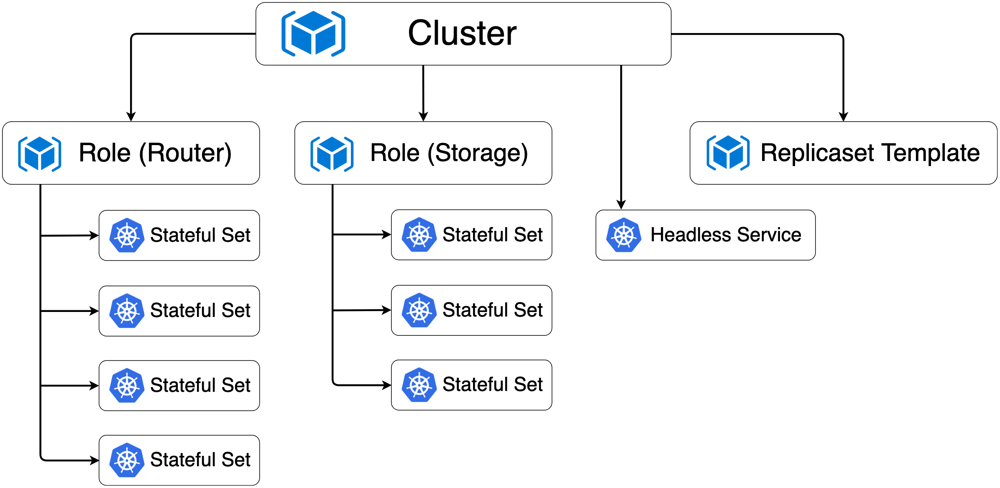
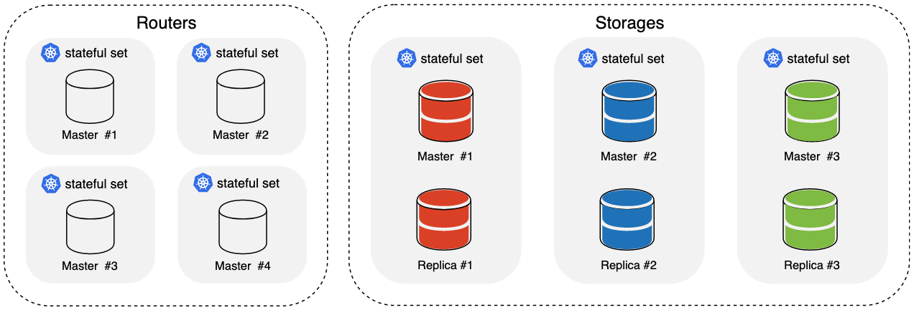
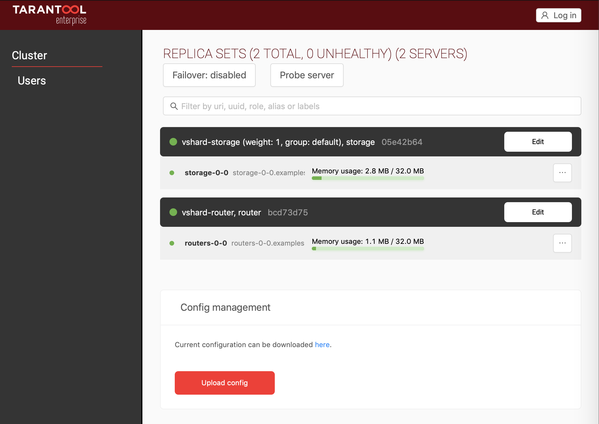

<a href="http://tarantool.org">
   
</a>

# Tarantool Kubernetes-оператор

Tarantool Kubernetes-оператор &mdash; это средство автоматизации, позволяющее
упростить администрирование Tarantool-кластеров, разработанных на фреймворке
[Tarantool Cartridge](https://github.com/tarantool/cartridge) и развернутых
под управлением Kubernetes.

Kubernetes-оператор реализует API версии `tarantool.io/v1alpha1` устанавливает
ресурсы для объектов трех типов: Cluster, Role и ReplicasetTemplate.

## Содержание

* [Ресурсы](#ресурсы)
* [Владение ресурсами](#владение-ресурсами)
* [Развертывание оператора в minikube](#развертывание-оператора-в-minikube)
* [Пример: база данных типа ключ-значение](#пример-база-данных-типа-ключ-значение)
  * [Топология приложения](#топология-приложения)
  * [Запуск приложения](#запуск-приложения)
  * [Масштабирование приложения](#масштабирование-приложения)
  * [Запуск тестов](#запуск-тестов)

## Ресурсы

**Cluster** &mdash; это кластер, разработанный с помощью Tarantool Cartridge.

**Role** &mdash; это пользовательская роль, разработанная с помощью Tarantool Cartridge.

**ReplicasetTemplate** &mdash; это шаблон StatefulSet-ов, которые являются членами Role.

## Владение ресурсами

Так выглядит иерархия владения у ресурсов, которыми управляет запущенный оператор:



Иерархия владения ресурсами прямым образом влияет работу сборщика мусора в Kubernetes.
Если выполнить команду удаления на родительском ресурсе, то сборщик удалит и все
зависимые ресурсы.

## Развертывание оператора в minikube

1. Установите необходимое ПО:

    - [kubectl](https://kubernetes.io/docs/tasks/tools/install-kubectl)

    - [minikube](https://kubernetes.io/docs/tasks/tools/install-minikube/)

1. Создайте кластер в `minikube`:

    ```shell
    minikube start --memory=4096
    ```

    Для работы кластера и приложений-примеров вам понадобится выделить 4Gb оперативной памяти.

    Удостоверьтесь, что `minikube` успешно запущен:

    ```shell
    minikube status
    ```

    В случае успеха вывод в консоли будет выглядеть так:

    ```shell
    host: Running
    kubelet: Running
    apiserver: Running
    ```

1. Активируйте компонент Ingress:

    ```shell
    minikube addons enable ingress
    ```

1. Создайте ресурсы для оператора:

    ```shell
    kubectl create -f deploy/service_account.yaml
    kubectl create -f deploy/role.yaml
    kubectl create -f deploy/role_binding.yaml
    ```

1. Создайте пользовательские описания ресурсов (CRD) для оператора:

    ```shell
    kubectl create -f deploy/crds/tarantool_v1alpha1_cluster_crd.yaml
    kubectl create -f deploy/crds/tarantool_v1alpha1_role_crd.yaml
    kubectl create -f deploy/crds/tarantool_v1alpha1_replicasettemplate_crd.yaml
    ```

1. Запустите оператор:

    ```shell
    kubectl create -f deploy/operator.yaml
    ```

    Удостоверьтесь, что оператор успешно запущен:

    ```shell
    kubectl get pods --watch
    ```

    Дождитесь, пока Pod `tarantool-operator-xxxxxx-xx` перейдет в статус `Running`.

## Пример: база данных типа ключ-значение

В директории `examples/kv` содержится код распределенного приложения на Tarantool,
которое реализует базу данных типа ключ-значение.
Доступ к данным осуществляется с помощью HTTP REST API.

### Топология приложения



### Запуск приложения

Предполагается, что все команды выполняются из корня репозитория,
а Tarantool-оператор уже запущен и работает.

1. Создайте кластер:

    ```shell
    kubectl create -f examples/kv/deployment.yaml
    ```

   Дождитесь, пока все Pod-ы кластера перейдут в статус Running:

     ```shell
     kubectl get pods --watch
     ```


1.  Удостоверьтесь, что Cluster готов к работе:

    ```shell
    kubectl describe clusters.tarantool.io examples-kv-cluster
    ```

    ожидаем, когда поле Status.State примет значение Ready:

    ```shell
    ...
    Status:
      State:  Ready
    ...
    ```

1. Откройте веб-интерфейс администратора кластера:

   1. Узнайте IP-адрес виртуальной машины `minikube`:

       ```shell
       minikube ip
       ```

   1. Откройте страницу **http://MINIKUBE_IP** в браузере,
      заменив MINIKUBE_IP на IP-адрес из вывода предыдущей команды.

      

1. Выполните API-запросы к хранилищу:

   1. Запишите в базу тестовые данные:

       ```shell
       curl -XPOST http://MINIKUBE_IP/kv -d '{"key":"key_1", "value": "value_1"}'
       ```

   1. Запросите данные из базы:

       ```shell
       curl http://MINIKUBE_IP/kv_dump
       ```

### Масштабирование приложения

1. Увеличьте количество репликасетов-хранилищ:

    ```shell
    kubectl scale roles.tarantool.io storage --replicas=3
    ```

    В результате к существующему кластеру добавятся новые репликасеты.

    Проверьте в веб-интерфейсе, что топология изменилась.

1. Увеличьте количество реплик внутри каждого репликасета-хранилища:

    ```shell
    kubectl edit replicasettemplates.tarantool.io storage-template
    ```

    В открывшемся текстовом редакторе поменяйте значение поля `spec.replicas`
    на 3, сохраните изменения и закройте редактор.

    В результате к каждому репликасету-хранилищу добавятся новые реплики.

    Проверьте в веб-интерфейсе, что топология изменилась.

### Запуск тестов

```shell
make build
make start
./bootstrap.sh
make test
```
